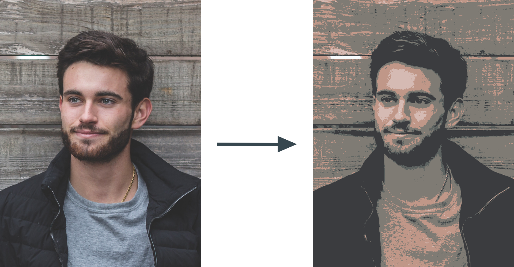

# Vision
Shed a different light to a picture.



## Description
Vision is a simple algorithm that generates and outputs a new, different style of image based on the given input image.

An example output is shown above.

## Code
Vision is written in both Python (3) and Java. Both programs should be run from the command line, in the following formats, respectively:

**For vision.py**
```
$ curl https://projects.xtrp.io/source/vision/vision.py -o vision.py
$ python3 vision.py path/to/input_image.png path/to/output_image.png
```

**For Vision.java**
```
$ curl https://projects.xtrp.io/source/vision/Vision.java & javac Vision.java
$ java Vision path/to/input_image.png path/to/output_image.png
```

```path/to/input_image.png``` and ```path/to/output_image.png``` should be replaced with the relative path to the input image and output image paths respectively.

Note that the input and output images can be of any mainstream image filetype (png, jpeg, etc.), and that before running either the Java or Python versions, Java/Python3 must be installed on your machine.

## Web Implementation

A web implementation was written with PHP and HTML &amp; CSS, which can be found at ```site/``` in this repo. You can run a PHP server on that directory and use the GUI to generate Visions of a given photo. I would like to put the site up in the near future, however I have been having server problems with Python3 and PHP.

## Algorithm
The algorithm is quite simple, and is based on randomness.

It starts by choosing a random open pixel, with an RGB color. Call the sum of the R, G, and B values of this random pixel ```n```.

Then, it loops through every pixel in the image, and sums the R, G, and B values of the current pixel. Call this sum ```m```. It then compares ```m``` to ```n```, checking if the difference between sum of the current pixel (```m```) and the random pixel (```n```) is less than 75. 75 can be changed to a different amount in the program for differing results. If the difference is indeed less than 75, then the color of the current pixel is subsequently changed to the value of the randomly chosen pixel at the beginning.

The program then repeats these steps until all pixels in the image have been filled.

### TL;DR

In short, the program chooses several random colors in the image, and goes through every pixel, and if a pixel is similar enough to one of the random colors, its value is changed to that random color.

### Results

The results of this program are very interesting. The randomness of the base colors chosen produces an interesting and unique design, where images can have a different tint of a certain set of base colors, and generated output images for a given input image are all uniquely different.

An example input and output is shown above, and I encourage you to try out the Python or Java Versions yourself!

### License and Credits

This program is licensed under the **MIT License**. See LICENSE.md for more info.

This program was built by [Fred Adams](https://xtrp.io/).
